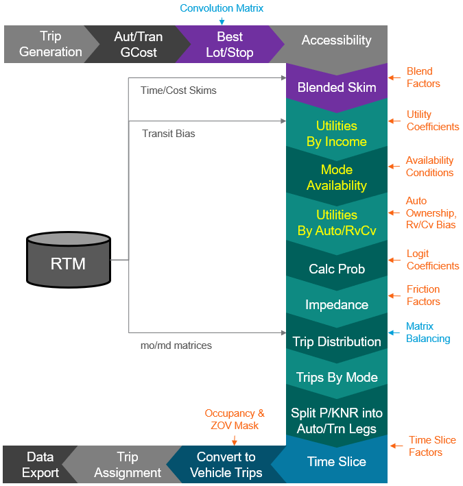

# Advanced Inputs

Advanced inputs are enabled for most of mode choice and trip assignment in the RTM. This allows modelers to update the mode choice model, household segmentations for assignment, and update time slicing definitions.

The figure below presents elements of the RTM framework that is programmable through advanced inputs using a set of yaml configuration files and input data. Components labeled in grey - trip attraction, trip production, generalized cost and accessibility calculations, trip assignment, and data export - are currently outside of the advanced input scope. If you need to reprogram those components of the RTM, proficiency with EMME toolbox and Python 3 is required.




## Configurations

### Yaml Files

The Yaml configuration file for RTM advanced inputs have three major sections: Files, Steps, and Functional Parameters. The Files section provides input and output files locations. The Steps section provides a list of function calls that are made in python. Finally, the Functional Parameters section provide a list of parameter values relevant to each function call. An Example of yaml file for best lot calculations can be found below:

```yaml
# Compute Best Lot Input Files
FILES:
    INPUTS:
        COST: BestStop/ComputeBestLot_Cost.csv
        AVAILABLE_LOT: BestStop/ComputeBestLot_Lot.csv
        
    OUTPUTS: 
        BEST_LOT: BestStop/BestLot.fea

# Blended Skim Steps: Each Step is a Function
STEPS:
    - get_best_lots

get_best_lots: 
    Target_Column: Target
    Available_Lot_Column: Available_Lot
    Costij_Column: Costij
    Costjk_Column: Costjk
```

!!! note

    Adding additional steps will require changes be made in python. Changing input and output file values as well as functional parameter values can be done directly with the yaml file.


### Input Files

#### Flat Files

Flat file are used for specifying matrices used in calculations. The matrices specify can be input, intermediate, and output matrices depending on the context of the flat file being used. For more information on a specific flat input file, please refer to the flat file in the context of the yaml file and relevant step in the model flow.


#### Binary Files

Binary file are often used for serialized input data or intermediate data storage. Binary files are not designed to be read by users and they are typically cleaned up after a full model run. The current binary data format being used the the RTM is `feather`. Since the deserialization of binary file depends on the version of the data format implemented, there is no guarantee that these data files are backward or forward compatible; therefore, binary files are not used for permanent data storage.


## Compute Best Lot

The Compute Best Lot step generates matrices used in evaluating the optimal cost of intermodal trips. From a list of eligible zones (j), the compute best lot algorithm builds a list of total cost from i to j to k, then find the best cost for every i to k pair via the optimal j lot. This procedure requires the following inputs, as identified in `ComputeBestLot.yaml`:

* **AVAILABLE_LOT** (default: `BestStop/ComputeBestLot_Cost.csv`) - a list of intermediate lots available for each horizon year. 
    * Each lot type is delimited by comma which is then further delimited by semicolon, for example for year 2017, `gn1;gn3,gn1;gn3,gn1;gn3` corresponds to PNR_Lot of `gn1` and `gn3`, KNR_Lot of `gn1` and `gn3`, TNCNR_Lot of `gn1` and `gn3`. 
    * Add new columns if additional lots are needed.
* **COST** (default: `BestStop/ComputeBestLot_Lot.csv`) - specification of cost for matrix calculation. 
    * The cost is calculated by the optimizing the total cost of `Costij_Column` and `Costjk_Column` using a convolution algorithm. The minimum cost for an optimal lot is the result of the computation.
    * Each row specify a variable correspond to a particular cost assigned to new matrix name defined by `Target_Column`.
    * The lot type is defined by shared column name for `Available_Lot_Column`. 
    * A specific mode for each leg of the cost need to be specified also with `Modeij` and `Modejk`. 
    * Add more rows for additional cost that need to be computed.


## Blended Skim

Skim blending further prepares data required for mode choice after best lot computation. Skim blending is the process of producing daily cost from peak hour scenarios, using a set of blending factors. The skim blending process first build daily cost from simple expressions (if applicable). Then, it adds all the peak hour components multiplied by corresponding factors. Finally, adjustments are made for intermodal variables requiring cost from best lot calculations. There are three required file inputs, which can be found in `Blended_Skim.yaml`:

* **SPEC** (default: `ModeChoice/Blended_Skim.csv`) - path to csv file containing the list of skims (or expressions) associated with blending factors, segmentations, and associated trip purpose.
* **COEFFICIENTS** (default: `ModeChoice/Blended_Skim_Coeffs.csv`) - path to csv file containing all blending factors that are referenced by the **SPEC** file. Typically, the blending factors are time of day and production-attraction (PA) specific.
* **BEST_LOT** (default: `BestStop/BestLot.fea`, *leave as default*) - the intermediate binary data file output from the compute best lot calculation. 

In addition to file inputs that provide the required data for skim blending, a structure of the blending procedure needs to be specifed in the YAML file under the `Blending` setting:

* **Target_Column** - the name of the maxtrix which the *result* of the skim blending calculation to be stored.
* **Key_Column** - the name of the factor that will be applied to perform skim blending.
* **Seg_Column** - the list of columns containing segmentation.
* **Factors** - outlines the structure of blending factor that corresponds to the data provided in **COEFFICIENTS** input. The columns in P-A or A-P will be multiplied by columns in **Skims_Columns** when calculating each skim blending variable.
* **Skims_Columns** - the list of columns with time of day scenario skims.
* **Expresstion_Column** - instead of Skim Columns by time period, an expression may be specified for all time periods. For example, `np.transpose(df['prtrmt'])` for transposed vector matrices of park and ride terminal time.


## Mode Choice By Purpose


### Trip Purposes

The mode choice module computes the trips from production to attraction zones, and prepares the model data for time slicing, and subsequently, trip assignment. There are a total of nine trip purposes modeled, each have a separate mode choice model structure:

* **Home-based Work** - settings in `ModeChoice/UtilityByPurpose/HWRK.yaml`
* **Home-based University** - settings in `ModeChoice/UtilityByPurpose/HUNI.yaml`
* **Home-based School** - settings in `ModeChoice/UtilityByPurpose/HSCH.yaml`
* **Home-based Escorting** - settings in `ModeChoice/UtilityByPurpose/HESC.yaml`
* **Home-based Shopping** - settings in `ModeChoice/UtilityByPurpose/HSHP.yaml`
* **Home-based Social** - settings in `ModeChoice/UtilityByPurpose/HSOC.yaml`
* **Home-based Personal Business** - settings in `ModeChoice/UtilityByPurpose/HPBS.yaml`
* **Non-home-based Work** - settings in `ModeChoice/UtilityByPurpose/NWRK.yaml`
* **Non-home-based Other** - settings in `ModeChoice/UtilityByPurpose/NOTH.yaml`

In order to compute trip demand by purpose and by mode, utility, probability, trip distribution, trip demand, and accessibility calculation were performed. These steps are outlined in detail in the following sub sections.

### Nhb Trip Generations

Since the latest RTM uses the attraction of home-based trips as production of non-home-based trips, a custom trip generation needs to be performed at the beginning of each non-home-based mode, after all the home based models are computed. This procedure is called `NonHomeBased_TripGen` and are appended to `STEPS` for `NWRK.yaml ` and `NOTH.yaml`.


### Utility

The utilities of available modes are based on mode availability and cost. The global mode availabilities are define in `AVAILCONDITION` and `AVAILCHECK`. The `AVAILCONDITION` csv file defines all the availability tests performed to establish the availability conditions. There will often be more than 1 condition per each mode's availability. The `AVAILCHECK` csv file establish mode availability by segmentation. Availability parameters can vary across trip purposes and are specifried in `ComputeUtil:Availability`. Segmentations are often different across trip purpose and are specified in `ComputeUtil:SEGMENTS`. 

The mode choice utility calculation for unavailable modes are masked with a large negative value (-99999). For available choices, the utility of each sub-mode is calculated based on the mode choice utility functions, specified by a set of csvs:

* `SPEC` (i.e.: `HWRK.csv`) - a list of cost with expression and coefficients, by default, these cost are grouped into variables and are further defined by `COEFFICIENTS` and `SEGMENTS`.
* `COEFFICIENTS` (i.e.: `HWRK_Coeffs.csv`) - a list of coefficient variable and values.
* `SEGMENTS` (i.e.: `HWRK_Segments.csv`) - segment specific values and coefficient for utility computation.
* `MATRIXDATA` (i.e.: `HWRK_MatrixData.csv`) - a list of matrices by mode to be prepared for utility calculations. They should be specified if they are used as a variable so they are ready to be used.


### Probability

After utility calculations, the choice probability for each mode is calculated based on theta and nesting strcture defined in `CalcProb:NESTS` within each yaml file. The list of alternatives at the lowest nesting level must match the name of the modes in `Util_Data_Mode_Group`.


### Trip Distribution

Trip distribution is performed based on balncing type and impedance function defined for the trip purpose. Depending on the tirp purpose, different balancing types such as `two_dim_matrix_balancing` and `one_dim_matrix_balancing` can be specified. The impedance is based on calculation with K-factor (Kij) and needs to be specified in the `DISTRIBUTIONIMP` csv file. The impedance function may vary by segmentation and by modes.


### Trip Demand

Although the mode choice trips can have very detailed segmentation and sub-modes, for the purpose of network assignment, the trips need to be aggregated and separated into different networks, mainly auto network, transit network, and active network. The TNC or Taxi network may be available depending on the availability of those modes. The trip demand calculation vary by trip purpose and can be specifed in `TripsByMode` within each yaml file.


### Accessibility

The accessibility calculation is a post-processing routine that produce logsum accessibility measures that can be useful for preliminary analysis of user benefits. The `ComputeAccessibility:Logsum_Coeff` for each trip purpose should correspond to the top level theta for that mode choice model. And the specific modes used in accessibility calculation can be specified within `ComputeAccessibility:Accessibility_Modes`. The group of modes specified here do not need to reflect mode choice nesting structure and are provided here for reporting purposes.


## Time Slicing

Time slicing is required to split daily trips into multiple time of day so the trip demand results can be feed back into the model for network assignment. 

In order to perform time slicing, the production-attraction trips need to be split into multimodal legs and into specific assignment modes, as specified in the `MULTIMODAL_LEGS` csv. Using the best lot computation results, the multimodal trip travel times are built.

If zero-occupancy vehicles are present, the trips will be adjusted. For high-occupancy modes like HOV, transit, and TNCs, occupancy adjustments will be made. Finally the time slicing factors then need to be applied to the adjusted daily trips.


<!-- Links -->
[User Guide's Requirements]: ../workflow/#requirements
