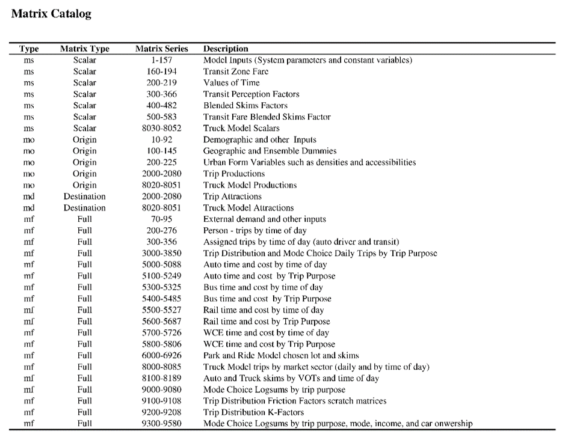

# Appendix

In this section, you will find some useful infomation you may need to use in your RTM application project. Some of them are RTM assumptions and some of them are the calibrated factors. This document could be a dictionary of the model components.

## Modes and Vehicles

This section shows the link and transit mode, and transit vehicle type

### Link mode

Mode | Description
-- | --
v | Vehicles (Primary Auto Mode)
c | High Occupancy Vehicles (HOV)
d | Single Occupancy Vehicles (SOV)
x | Light Trucks
t | Heavy Trucks
n | Discourage Heavy Vehicle Traffic
b | Bus
p | Pedestrian
a | Auxillary Transit Access
l | SkyTrain
r | Commuter Rail (WCE)
s | SeaBus
h | Gondola

### Transit mode

Mode | Description
-- | --
b | Bus
l | SkyTrain
r | Commuter Rail (WCE)
s | SeaBus
g | BRT
f | LRT
h | Gondola

### Transit Vehicle Capacity and Cost

The table below gives a transit vehicle capacity and cost catalog. The value is used in the capacited transit assignment. 

Transit Vehicle | Mode | Fleet Size | Capacity(S/T) | OC($/h) | OC($/km) | Auto. equ
--------------- | ---- | ---------- | ------------- | ------- | -------- | ---------
1.Motor-Bus | b | 747 | 35/50 | 65 | 0.55 | 2.5
2.Trolley | b | 224 | 31/47 | 65 | 0.55 | 2.5
3.Blue-Bus | b | 48 | 31/47 | 65 | 0.55 | 2.5
4.Sea-Bus | s | 2 | 300/400 | 0 | 0 | 0
5.Sky-E | l | 999 | 88/287 | 0 | 3 | 0
6.pcl-bus | b | 20 | 50/50 | 30 | 0.55 | 2.5
7.Abbotsford | b | 12 | 48/60 | 30 | 0.55 | 2.5
8.Comrail-5 | r | 5 | 1500/1650 | 0 | 0 | 0
9.Chilliwack | b | 12 | 48/60 | 30 | 0.55 | 2.5
10.Mot-Artics | b | 42 | 48/90 | 65 | 0.55 | 3.75
11.Tro-Artics | b | 1 | 49/70 | 65 | 0.55 | 3.75
12.HwyCoach | b | 66 | 49/49 | 65 | 0.55 | 2.5
13.MiniBus | b | 40 | 20/24 | 65 | 0.55 | 2.5
14.Sky-M | l | 999 | 140/300 | 0 | 0 | 0
15.Sky-Sh | l | 999 | 150/350 | 0 | 0 | 0
16.BRT | g | 42 | 60/105 | 0 | 0 | 3.75
17.LRT | f | 1 | 160/300 | 0 | 3 | 0
18.Gondola | h | 20 | 28/35 | 0 | 0 | 0
20.Sky-ML2 | l | 999 | 127/218 | 0 | 0 | 0
31.EL-2017 | l | 999 | 174/424 | 0 | 3 | 0
32.EL-2030 | l | 999 | 143/509 | 0 | 3 | 0
33.EL-2045 | l | 999 | 143/509 | 0 | 3 | 0
34.ML-2017 | l | 999 | 66/222 | 0 | 3 | 0
35.ML-2030 | l | 999 | 132/444 | 0 | 3 | 0
35.ML-2030 | l | 999 | 132/444 | 0 | 3 | 0
36.ML-2045 | l | 999 | 132/444 | 0 | 3 | 0
37.CL-2017 | l | 999 | 88/288 | 0 | 3 | 0
38.CL-2030 | l | 999 | 88/288 | 0 | 3 | 0
39.CL-2045 | l | 999 | 110/360 | 0 | 3 | 0

## Volume Delay Function

VDF | Description | Expression
--- | ----------- | ----------
11 | Centroid Connector | length x 60/40
12 | Bowen Island Service | 40 + (volume-100) x 60/volume x (volume>=100)
13 | Highway Merge Lane | length x 60/posted_speed + 0.85 x (volume/(capacity x lanes))^5
14 | Stop Sign and Signal| signal_delay + length x 60/posted_speed + 0.85 x (volume/(capacity x lanes))^4
15 | Free Flow | length x 60/posted_speed x (1+0.6 x 0.85 x (volume/(capacity x lanes^1.05))^5)
16 | Free Flow | length x 60/(posted_speed x 1.1) x (1+0.6 x 0.43 x (volume/(capacity x lanes^1.05))^5.25)

## Time of Assginment

The RTM model only handles 3 scenarios in each databank. Each scenario stores one-hour assignment result, and it is used to represent various periods throughout the day.

Peak Period | Hour | Hours of the day represented
----------- | ---- | ----------------------------
AM | 07:30 - 08:30 | 06:00 - 10:00
MD | 12:00 - 13:00 | 10:00 - 15:00, 18:00 - 06:00
PM | 16:30 - 17:30 | 15:00 - 18:00

## Expansion Factor
The traffic expansion factor is to convert the model assigned hourly traffic volume to daily volume. The factor set has a generic set and categorized set. Both sets can be used according to the study purpose.
### All Class
AM | MD | PM
-- | -- | --
3.68 | 9.20 | 3.11

### By Category
Class | AM | MD | PM
-- |-- | -- | --
SOV | 3.44 | 8.41 | 3.95
HOV | 1.51 | 8.58 | 5.32
SOV+HOV | 3.22 | 8.63 | 4.05
LGV | 3.59 | 5.63 | 6.17
HGV | 4.88 | 5.43 | 6.36
LGV+HGV | 3.83 | 5.81 | 6.63

### Transit Ridership
The transit expansion factor converts the hourly transit ridership to daily value. Like auto traffic, the factor set is classed by different types of service. The value shows below. (*SeaBus has the same factor with Rail)

Transit mode | AM | MD | PM
-- |-- | -- | --
Bus | 2.54 | 9.44 | 2.57
SkyTrain | 2.53 | 9.54 | 2.92
WCE | 3.34 | - | 2.02

## Annual Factor

The annual expansion factor is to expend the daily volume on typical fall weekday to yearly volume. The generic expansion factor, including all vehicle classes, is 333. And the factors for each class are shown below: 

Class | Factor 
----- | ------ 
All Classes | 333
Auto | 335
LGV | 313
HGV | 276
Bus | 299
Skytrain | 331
WCE | 224

## Transit Perception Factor
Transit perception is a factor that can reflect the user’s feeling about taking transit in each stage. It is used in the mode choice model. The values are cited from the literature with some minor adjustment based on local knowledge.
Note that the boarding perception factor used for transfer boarding only. The model assumed there is no penalty for initial boarding. Current model only account perception impact for work purpose only.

Bus/Rail/WCE | Time Component | Matrix | EMME Name | Value
------------ | -------------- | ------ | --------- | -----
Bus | In-vehicle | ms300 | busIVTprcpWk                                      | 1.25
-- | Wait | ms301 | busWAITprcpWk                                     | 2.50
-- | Walk | ms302 | busWALKprcpWk                                     | 2.00
-- | Boarding | ms303 | busBOARDSprcpWk                                   | 10.00
Rail | In-vehicle | ms310 | railIVTprcpWk                                     | 1.00
-- | Wait | ms311 | railWAITprcpWk                                    | 2.50 
-- | Walk | ms312 | railWALKprcpWk                                    | 2.00 
-- | Boarding | ms313 | railBOARDSprcpWk                                  | 10.00 
WCE | In-vehicle | ms320 | wceIVTprcpWk                                      | 1.00
-- | Wait | ms321 | wceWAITprcpWk                                     | 2.50 
-- | Walk | ms322 | wceWALKprcpWk                                     | 2.00 
-- | Boarding | ms323 | wceBOARDSprcpWk                                   | 10.00 

## Matrix

Over thousand matrices are used in the RTM simulation. Here is a list showing the matrices grouped by the functions

Click [here] to see the full list of the matrix
[here]:/matrix_list

## Ensembles

The ensemble is a useful tool to group the zones by different purposes, either for geographical mapping or model calculating. There are various ensembles in the RTM model. Some of them are under implementation. Some of them are historically used and not functional at this moment, but we keep them as a placeholder for future usage. [This] is a list of ensembles that the latest RTM is using.

[This]:/img/appendix/Ensemble_Index.pdf "Ensemble Index pdf"
