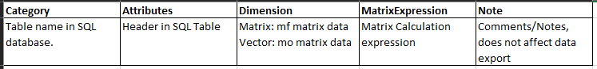
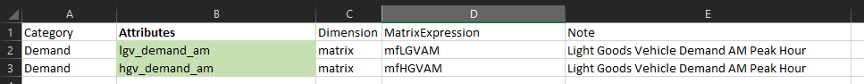
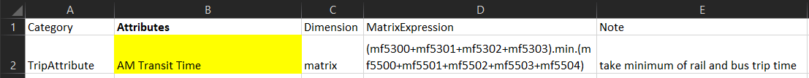
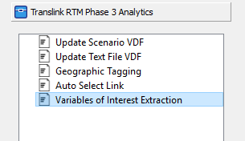

# Model Data Analysis

## Python libraries and the EMME python

In general the RTM uses the default python libraries installed with the EMME python.  In some cases this means foroging features that have been recently introduced or having code that is not compatible with python installations outside EMME.  However, it ensures that the RTM will run without further configuration providing the user has installed the correct version of EMME.  

## Python + util

The RTM scripting employs a utility toolbox that creates functions for repeated operations.  It is worth familiarizing yourself with the functions here as they are often employed outside the RTM run itself to post-process data.

For example, util can be used to create a pandas dataframe for full matrices and append RTM matrices to it for futher analysis or plotting in python.  

        util = _m.Modeller().tool("translink.util")

        df = util.get_pd_ij_df(eb) # create a longform pandas dataframe for full matrices

        # add columns for light and heavy truck OD tables to the data frame
        df['amLGVDemand'] = util.get_matrix_numpy(eb, "mfLGVAM").flatten() 
        df['amHGVDemand'] = util.get_matrix_numpy(eb, "mfHGVAM").flatten()

In the above example matrix names or numbers can be used to access the data.

## Data extraction using variables of interest tool

In this example we use a spreadsheet to build a sqlite database.  This tools allows the user to create tables and fields within a table using EMME matrix calculations.  The `Variables_of_Interest.xlsx` spreadsheet is located in the `RTM/Scripts/Phase3Analytics` folder. 

#### Setting up the spreadsheet
The `Datamap` tab describes what each field does in the `Sheet1` tab.  The `Sheet1` tab is used to build the database.  

A simple matrix calculation can be used to extract data.  Entering the following in `Sheet1` will create a table in the output sqlite database with AM demand for light and heavy goods vehicles equivalent to the pandas data frame example above:

In addtion to simple data extraction, new data can be generated based on RTM outputs using EMME matrix calculator expressions.  For example, we can create a matrix of the minimum time on transit between all zones considering both the bus and rail modes.  Note that we can reference EMME matrices by name or number.  

!!! Warning
    All `Attributes` (fields) associated with the same `Category` (table) must be of the same dimension.  For example, full matrices (MF) and vectors (MO/MD) must be placed in separate tables.

#### Running the Modeller Tool
Once you have specified  the data you wish to output in in `Sheet1`, the modeller tool `Variables of Interest Extraction` located in the Phase3Analytics Toolbox can be run to produce the outputs.

!!! note
    This tool requires the installation of one additional python library.  Installation instructions can be found in the tool documentation at `RTM/Documentation/ToolDoc_VariablesOfInterest.pdf`.  

To create the database with your specified tables and fields simply run the tool with the appropriate sheet name in the field.  If you have not changed the name from `Sheet1` there is nothing to update and you can simply run the tool.  

!!! note
    The name `Sheet1` can be changed to any Excel allowable name.  The chosen name needs to be passed to the tool either in the modeller interface or the function call.    

#### Viewing results
The requested results will be output to a sqlite database named `Variables_of_Interest_Results.db`.  The output can be viewed in the same manner as the `trip_summaries.db` and `rtm.db` discussed here [data_outputs/#using-the-rtm-and-trip-summaries-databases]