# Model Data Analysis

## Python libraries and the EMME python

In general the RTM uses the default python libraries installed with the EMME python.  In some cases this means foregoing features that have been recently introduced or having code that is not compatible with python installations outside EMME.  However, it ensures that the RTM will run without further configuration providing the user has installed the correct version of EMME.  

## Python + util

The RTM scripting employs a utility toolbox that creates functions for repeated operations.  It is worth familiarizing yourself with the functions here as they are often employed outside the RTM run itself to post-process data.

For example, util can be used to create a pandas dataframe for full matrices and append RTM matrices to it for further analysis or plotting in python.  

```Python
    import inro.modeller as _m

    util = _m.Modeller().tool("translink.util")

    eb = _m.Modeller().emmebank

    df = util.get_pd_ij_df(eb) # create a longform pandas dataframe for full matrices

    # add columns for light and heavy truck OD tables to the data frame
    df['amLGVDemand'] = util.get_matrix_numpy(eb, "mfLGVAM").flatten() 
    df['amHGVDemand'] = util.get_matrix_numpy(eb, "mfHGVAM").flatten()
```

 Which yields the following results:


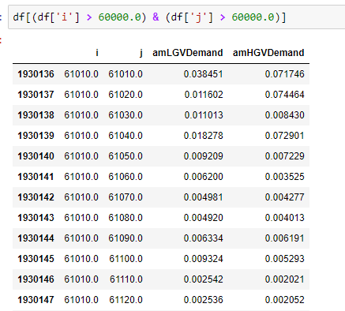

In the above example matrix names or numbers can be used to access the data in `util.get_matrix_numpy()`. 

## Data extraction using variables of interest tool

In this example we use a spreadsheet to build a sqlite database.  This tools allows the user to create tables and fields within a table using EMME matrix calculations.  The `Variables_of_Interest.xlsx` spreadsheet is located in the `RTM/Scripts/Phase3Analytics` folder. 

#### Setting up the spreadsheet
The `Datamap` tab describes what each field does in the `Sheet1` tab.  The `Sheet1` tab is used to build the database.  


A simple matrix calculation can be used to extract data.  Entering the following in `Sheet1` will create a table in the output sqlite database with AM demand for light and heavy goods vehicles equivalent to the pandas data frame example above:


In addition to simple data extraction, new data can be generated based on RTM outputs using EMME matrix calculator expressions.  For example, we can create a matrix of the minimum time on transit between all zones considering both the bus and rail modes.  Note that we can reference EMME matrices by name or number.  


!!! Warning
    All `Attributes` (fields) associated with the same `Category` (table) must be of the same dimension.  For example, full matrices (MF) and vectors (MO/MD) must be placed in separate tables.


#### Running the Modeller Tool
Once you have specified  the data you wish to output in in `Sheet1`, the modeller tool `Variables of Interest Extraction` located in the Phase3Analytics Toolbox can be run to produce the outputs.


!!! note
    This tool requires the installation of one additional python library.  Installation instructions can be found in the tool documentation at `RTM/Documentation/ToolDoc_VariablesOfInterest.pdf`.  

To create the database with your specified tables and fields simply run the tool with the appropriate sheet name in the field.  If you have not changed the name from `Sheet1` there is nothing to update and you can simply run the tool.  

!!! note
    The name `Sheet1` can be changed to any Excel allowable name.  The chosen name needs to be passed to the tool either in the modeller interface or the function call.    


#### Viewing results
The requested results will be output to a sqlite database named `Variables_of_Interest_Results.db`.  The output can be viewed in the same manner as the `trip_summaries.db` and `rtm.db` discussed [here](../data_outputs/#using-the-rtm-and-trip-summaries-databases)

## Post-processing tools

RTM provides several standard tools to help users quickly analyze the transportation results after the model run. The common-use pro-processing tools are select link analysis for traffic and select transit analysis for public transit. These two tools are also located in Phase3Analytics Toolbox.

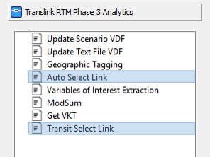
### Auto Select Link tool
The auto select link tool is for analyzing the auto traffic on a select link. The tool provides a simple capability to let user perform a quick select assignment. Set @selectlink=1 to select the link that to be evaluated.

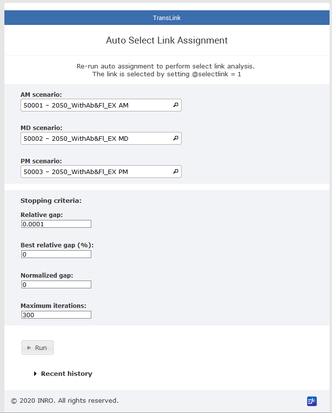{ width=75% }


### Transit Select link/line tool

The transit select tool provides larger capability to perform more complicated post analysis. It executes the transit assignment based on the select link/ line. Upon the request, the outputs can be:

- transit segment volumes, boardings, alightings for select transit link/line
- link auxiliary transit volume for select walk link
- matrices by transit sub-mode

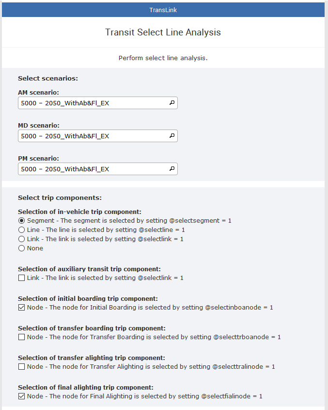{ width=70% }

***Before using the tool***

There are some procedures needs to be done prior to applying the select transit tool:
- Ensure the databank dimension has enough room for additional extra attributes. The recommended number is 2,500,000
- Strategies generated by extended transit assignments. (Finish full model run or transit assignment) 
- Recommend copy AM, MD, and PM scenario to prevent from overwriting the original scenario  
- Create the extra attribute(s) and set the appropriate value in all three scenarios (following the below instruction)

***After using the tool***

The tool performs post-analyses on paths extracted from strategies generated by extended transit assignments, and it creates:
1. new matrices and save the O-D results:

ID | Name | Descritption
-- | ---- | ------------
mf110 | AMBUSsline | AM Bus Select transit O-D
mf111 | AMRALsline | AM Rail Select transit O-D
mf112 | AMWCEsline | AM WCE Select transit O-D
mf113 | AMTOTsline | AM TOT Select transit O-D
mf130 | MDBUSsline | MD Bus Select transit O-D
mf131 | MDRALsline | MD Rail Select transit O-D
mf132 | MDWCEsline | MD WCE Select transit O-D
mf133 | MDTOTsline | MD TOT Select transit O-D
mf150 | PMBUSsline | PM Bus Select transit O-D
mf151 | PMRALsline | PM Rail Select transit O-D
mf152 | PMWCEsline | PM WCE Select transit O-D
mf153 | PMTOTsline | PM TOT Select transit O-D

2.new extra attributes and save network results:

Name | Descritption | Name | Descritption
---- | ------------ | ---- | ------------
@voltr_bussline|Transit Volume BUS|@board_bussline|Boardings BUS
@voltr_ralsline|Transit Volume RAL|@board_ralsline|Boardings RAL
@voltr_wcesline|Transit Volume WCE|@board_wcesline|Boardings WCE
@voltr_totsline|Transit Volume TOT|@board_totsline|Boardings TOT
@volax_bussline|Aux Transit Volume BUS|@alight_bussline|Alightings BUS
@volax_ralsline|Aux Transit Volume RAL|@alight_ralsline|Alightings RAL
@volax_wcesline|Aux Transit Volume WCE|@alight_wcesline|Alightings WCE
@volax_totsline|Aux Transit Volume TOT|@alight_totsline|Alightings TOT

3.Aggregate O-D result matrices and export to CSV: 
**<Project folder>\rtm\RTM\<databank>\Outputs\transit_sline_gy.csv)**

***transit link/line selection***

The transit link/line can be selected by setting up the trip components. There are multiple ways to select the trip component. One or more trip components can be taken into account:

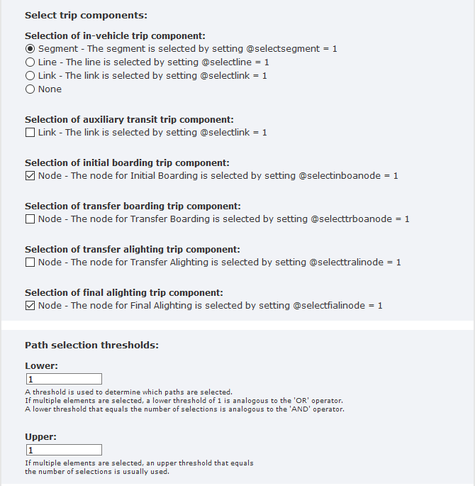{ width=70% }

- For in-vehicle trip component, the selections can be link (@selectsegment), transit line (@selectline), or segment (@selectlink). 
- Check the box if the trip component is an auxiliary transit link
- For boarding or alighting trip component, the selections is node attribute(@selectinboanode,@selectfialinode @selecttrboanode @selecttralinode ). Check one box from the node component upon the purpose. 

***Examples***

These are some examples related to trip component selection, and path selection threshold.

Case 1: The people who are in-vehicle in segment A 
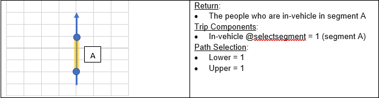
Case 2: The people who in-vehicle in segment A **OR** walk on link B
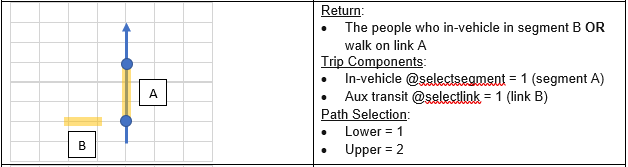
Case 3: The people who in-vehicle in segment A **AND** walk on link B
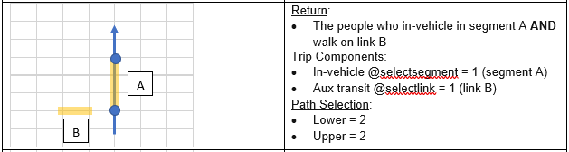
Case 4: The people who in-vehicle in segment A **AND** walk on link B **AND** transfer boarding at node C
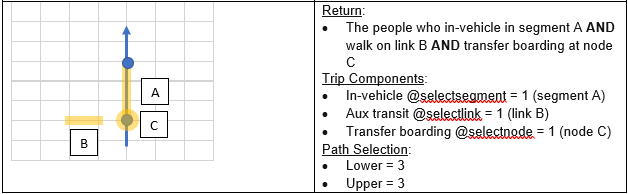
Case 5: The people who take any segment D of a transit line
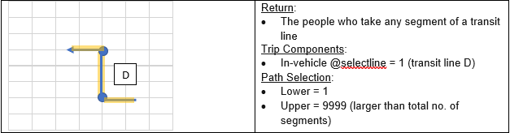
Case 6: The people who initially board at node C **AND** finally alight at node E
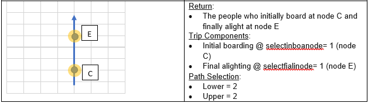