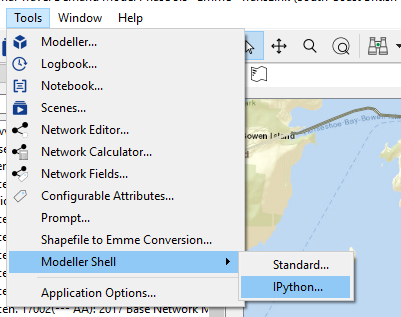
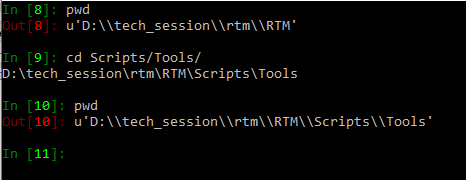
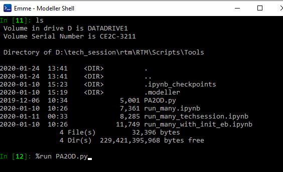
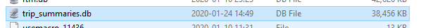
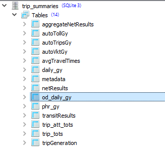

# Custom Data Generation

## Python script vs modeller tool

In general Modeller tools more polished and can provide a GUI, but take more time and effort to prepare.  They can still be called from other places and imported into other files.  We generally use these for production grade, stable solutions, that we intend to use repeatedly.  Object oriented.  It is expected that everyone here knows how to use a modeller tool

Python script can be built easily and often is enough to quickly complete a task at hand.  Maybe fragile, can break with simple model changes.  These may not be maintained.  These can work will with the notebooks.   They can just work with basic functions, easy to put together a basic but reproduceable analysis.  

#### Executing a python script from the EMME iPython shell

Open the ipython modeller shell in EMME desktop

Once in the shell, navigate to location of the subject script.  In this case the script in question is located in the `RTM/Scripts/Tools` directory

Check the files in this directory to ensure we have the one we want, then we can use the iPython magic `%run <filename.py>` to execute our script

## Example Tool for PA to OD

As a general rule in trip based modeling production/attraction (PA) trips can be converted to origin/destination (OD) trips roughly by `0.5 * (mat + mat')`.  However, for a variety of reasons, most notably non-home-based (NHB) trips, not everyting is completely symetrical.  Production to attraction blending factors have been calculated from the trip diary for the RTM skims.  

The example runs the `PA2OD.py` python script with the output directed to the `trip_summaries.db` database.  Once you have run the script, navigate to `RTM/<your_db_folder>` and open the trip_summaries.db in your sqlite viewer.  

Once there, we will see a new table named `od_daily_<your ensemble if any>`

From there we can query and view the resultst

#### Why does it run?

    if __name__ == '__main__':

    eb = _m.Modeller().emmebank
    # run with ensemble name and ensem_agg = True to aggregate
    # run with no ensemble name and ensem_agg = False to get TAZ level results
    # note, TAZ level results create very large file
    main(eb, ensem='gy', ensem_agg=True)

And why does this work?  See this video on [Youtube Name and Main]

[Youtube Name and Main]: https://www.youtube.com/watch?v=sugvnHA7ElY

## Using the notebook

