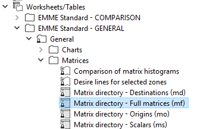
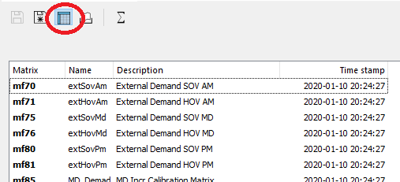
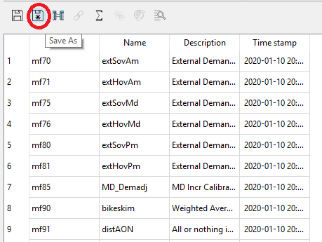
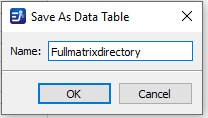
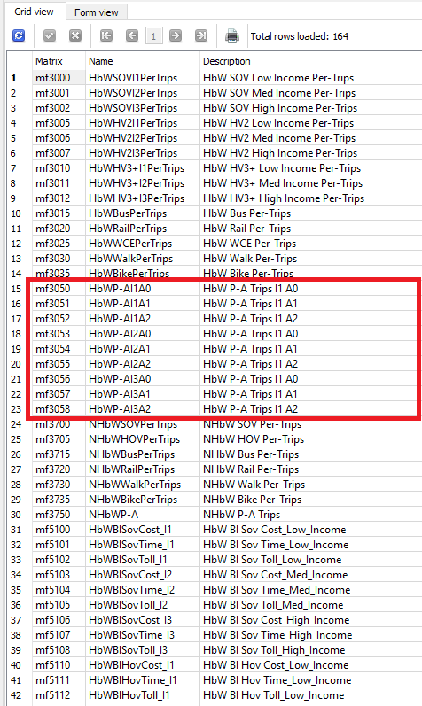
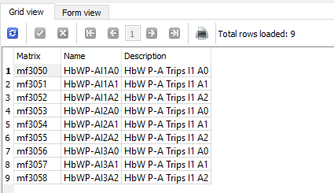
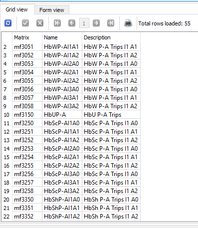
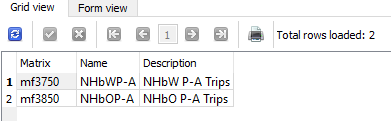

# Model Data Output

## Exporting full matrix directory

The RTM produces a lot of data for each run, there are more than 1,000 full matrices at the end of a run.  It's sometimes difficult to know what data is available afterwards.  EMME desktop provides a full matrix directory, but it is not directly searchable. However if we open the worksheet located here:

`Worksheets/Tables/EMME Standard - GENERAL/General/Matrices/Matrix directory - Full matrices (mf)`



Clicking on the icon that looks like a database table opens the worksheet as a datatable.  A datatable is effectively a sqlite database table.  



Click the `save as` button 



Removing spaces in the name simplifies later querying.



The matrix directory will be saved at the project level in the `RTM\data_tables.db` sqlite database, which we will query in the next section.  

## Searching for matrices

Now that we have the full matrix directory saved at the project level in the `RTM\data_tables.db` sqlite database, we can use SQL to search for matrices that are of interest.  Although there are a number of ways to access the database we recommend a sqlite viewer such as [SQLite Studio]

Suppose we are interested in commute trips and want to find home-based work production attraction (PA) matrices.  We can open the database in the sqlite viewer and execute the following query

```SQL
SELECT 
     Matrix
    ,[Name]
    ,[Description]

FROM Fullmatrixdirectory

WHERE 1=1
    and UPPER([Name]) LIKE '%HBW%'
    or  UPPER([Name]) LIKE '%WORK%'
    or  UPPER([Description]) LIKE '%HBW%'
    or  UPPER([Description]) LIKE '%WORK%'

```

Which yields the following results



We get 164 records, but can see the matrices we want highlighted in the red box.  Changing the `WHERE` clause returns only the results we want:

```SQL
SELECT 
     Matrix
    ,[Name]
    ,[Description]

FROM Fullmatrixdirectory

WHERE 1=1
    and UPPER([Name]) LIKE 'HBWP-A%'
```

Now we get only 9 results, 3 income categories by 3 auto ownership levels



Changing the `WHERE` clause as follows let's us see the PA tables for all home-based purposes

```SQL
SELECT 
     Matrix
    ,[Name]
    ,[Description]

FROM Fullmatrixdirectory

WHERE 1=1
    and UPPER([Name]) LIKE 'HB%P-A%'
```

Note that we get 55 records.  There are 7 home-based purposes, but home-based university does not have income and auto-ownership distinction so 6 x 9 + 1 = 55.  



Finally, we can add an 'N' to the `WHERE` clause to see the non-home-based purposes.  

```SQL
SELECT 
     Matrix
    ,[Name]
    ,[Description]

FROM Fullmatrixdirectory

WHERE 1=1
    and UPPER([Name]) LIKE 'NH%P-A%'
```

And here we get 2 records because there are 2 non-home-based purposes and they do not have income and auto-ownership distinction. 



Similar methods can be used to find other data of interest


## Using the rtm and trip summaries databases


<!-- Links -->
[SQLite Studio]: https://sqlitestudio.pl/index.rvt?act=download