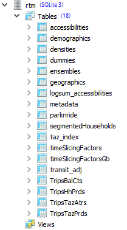
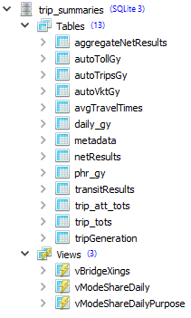
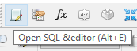
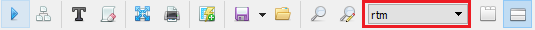

# Model Data Output

## Exporting full matrix directory

The RTM produces a lot of data for each run, there are more than 1,000 full matrices at the end of a run.  It's sometimes difficult to know what data is available afterwards.  EMME desktop provides a full matrix directory, but it is not directly searchable. However if we open the worksheet located here:

`Worksheets/Tables/EMME Standard - GENERAL/General/Matrices/Matrix directory - Full matrices (mf)`


Clicking on the icon that looks like a database table opens the worksheet as a datatable.  A datatable is effectively a sqlite database table.  


Click the `save as` button 


Removing spaces in the name simplifies later querying.


The matrix directory will be saved at the project level in the `RTM\data_tables.db` sqlite database, which we will query in the next section.  

## Searching for matrices

Now that we have the full matrix directory saved at the project level in the `RTM\data_tables.db` sqlite database, we can use SQL to search for matrices that are of interest.  Although there are a number of ways to access the database we recommend a sqlite viewer such as [SQLite Studio]

Suppose we are interested in commute trips and want to find home-based work production attraction (PA) matrices.  We can open the database in the sqlite viewer and execute the following query

```SQL
SELECT 
     Matrix
    ,[Name]
    ,[Description]

FROM Fullmatrixdirectory

WHERE 1=1
    and UPPER([Name]) LIKE '%HBW%'
    or  UPPER([Name]) LIKE '%WORK%'
    or  UPPER([Description]) LIKE '%HBW%'
    or  UPPER([Description]) LIKE '%WORK%'

```

Which yields the following results


We get 164 records, but can see the matrices we want highlighted in the red box.  Changing the `WHERE` clause returns only the results we want:

```SQL
SELECT 
     Matrix
    ,[Name]
    ,[Description]

FROM Fullmatrixdirectory

WHERE 1=1
    and UPPER([Name]) LIKE 'HBWP-A%'
```

Now we get only 9 results, 3 income categories by 3 auto ownership levels


Changing the `WHERE` clause as follows let's us see the PA tables for all home-based purposes

```SQL
SELECT 
     Matrix
    ,[Name]
    ,[Description]

FROM Fullmatrixdirectory

WHERE 1=1
    and UPPER([Name]) LIKE 'HB%P-A%'
```

Note that we get 55 records.  There are 7 home-based purposes, but home-based university does not have income and auto-ownership distinction so 6 x 9 + 1 = 55.  


Finally, we can add an 'N' to the `WHERE` clause to see the non-home-based purposes.  

```SQL
SELECT 
     Matrix
    ,[Name]
    ,[Description]

FROM Fullmatrixdirectory

WHERE 1=1
    and UPPER([Name]) LIKE 'NH%P-A%'
```

And here we get 2 records because there are 2 non-home-based purposes and they do not have income and auto-ownership distinction. 


Similar methods can be used to find other data of interest


## Using the rtm and trip summaries databases

In addition to the matrices generated by EMME and stored in the databank during full model run, the RTM saves various input and output data related to the model run in two sqlite databases.

The `rtm.db` database primarily store input data, intermediate values, or high-level model results useful for diagnosing model issues. You can view all the tables within this database with [SQLite Studio].
> 

<!-- 
NOT INCLUDING FOR NOW... Too much detail?

The following tables contain some key input data from the `rtm.db` database:

* **demographics**: Metro Vancouver growth projections used for the model run
* **dummies**: geographic dummies
* **ensembles**: groups of geographic regions
* **geographics**: geographic characteristics by traffic zones, such as parking rates, car share, and bike score.
* **metadata**: model scenario, year, and alternative definitions
* **parknride**: park and ride lot settings
* **segmentedHouseholds**: household segmentation by traffic zones
* **taz_index**: numbers of all traffic zones
* **timeSlicingFactors**: time slicing factors
* **timeSlicingFactorsGb**: time slicing factors full table

The following tables contain some intermediate values and high-level model results from the `rtm.db` database:

* **accessibilities**: distance-based accessibility measure
* **logsum_accessibilities**: logsum-utility-based accessibility measure
* **densities**: population and employment density
* **transit_adj**: transit bias adjustments
* **TripsBalCts**: 
* **TripsHhPrds**: 
* **TripsTazAtrs**: 
* **TripsTazPrds**:  -->

The `trip_summaries.db` database contains high-level results reported by GY (large multi-municipal groups for Metro Vancouver) and disaggregate-level results by network link and transit lines.
> 


### Database queries

SQLite databases are packaged into a single database file, so they are easy to create and share. Like other databases, users can run simple SQL queries to get quick answers about the data. To start writing queries, open query editor in SQLite Studio, then select the correct database to run the query from:
> 

> 


#### Query example: Traffic zone with highest employment density

If you are trying to get the max value from a table, use the max(colname) builtin function.

```sql
SELECT max(empdens) FROM densities
```

Results of the query would look something like this:

| max(empdens) |
|--------------|
|2821.884521484375|


If you are trying to get the max value for a certain set of rows, for instance, a certain range from taz, add `WHERE` statement

```sql
SELECT max(empdens) 

FROM densities 

WHERE TAZ1700>=10000 and 
      TAZ1700<20000
```

Sample results of query:

| max(empdens) |
|--------------|
|222.649658203125|

Notice how traffic zones in the 10000 series have lower maximum employment density than the entire region.


#### Query example: Total vehicle-kilometers (VKT) by peak period and origin GY

SQL is great at creating pivot tables from large dataset. The `sum` function computes total of values, and the `group by` statement define the variable which was used to aggregates the table values.

```sql
SELECT gy_i, 
       peak,
       sum(vkt) 

FROM autoVktGy 

GROUP BY gy_i,
         peak
```

Sample results of query:

| gy_i | peak | sum(vkt) |
|------|------|----------|
| 1 | am | 106675.75589299179 |
| 1 | md | 65820.09947714038 |
| 1 | pm | 97089.90104259636 |
| 2 | am | 229276.9490799977 |
| 2 | md | 134214.06760361523 |
| 2 | pm | 212243.29537474972 |
| 3 | am | 71116.98403721345 |
| 3 | md | 84972.73319700224 |
| ... | ... | ... |

[Learn more about SQL].


<!-- Links -->
[SQLite Studio]: https://sqlitestudio.pl/index.rvt?act=download
[Learn more about SQL]: https://www.w3schools.com/sql/
