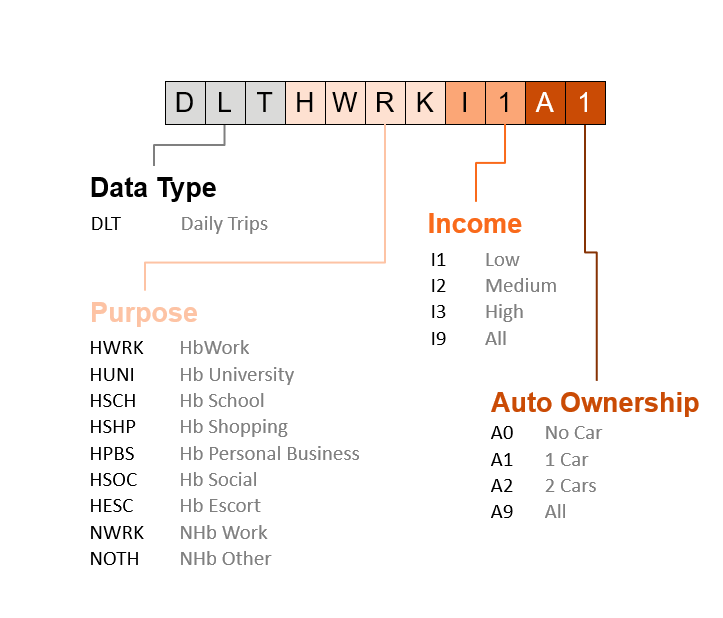

# Naming Conventions

## Matrix Names

Matrix names stored either as intermediate or final data will have the following naming conventions:

* Data Type (dtype)
    * DLT – Daily trips (Logsum)
    * LSM – Logsum utility (Logsum)
    * AMT – AM trips (Logsum)
    * MDT – Midday trips (Logsum)
    * PMT – PM trips (Logsum)
    * AMM – AM time (ROH)
    * MDM – Midday time (ROH)
    * PMM – PM constant (ROH)
    * AMC – AM constant (ROH)
    * MDC – Midday constant (ROH)
    * PMC – PM constant (ROH)
* Purpose
    * HWRK – Home-based work
    * HUNI – Home-based university
    * HSCH – Home-based school
    * HSHP – Home-based shopping
    * HPBS – Home-based personal business
    * HSOC – Home-based social
    * HESC – Home-based escort
    * NWRK – Non-home-based work
    * NOTH – Non-home-based other
* Income
    * I1 – low 
    * I2 – medium 
    * I3 – high 
    * I9 – all 
* Auto Ownership
    * A0 – no car
    * A1 – 1 car
    * A2 – 2 cars
    * A9 – all 
* Mode
    * SOV – single occupancy vehicle
    * HOV – high occupancy vehicle
    * BUS – bus
    * RAL – rail
    * WCE – West Coast Express
    * LGV – light truck
    * HGV – heavy truck

This is an example for *daily trip for home-based work, low income and 1-car household*:

