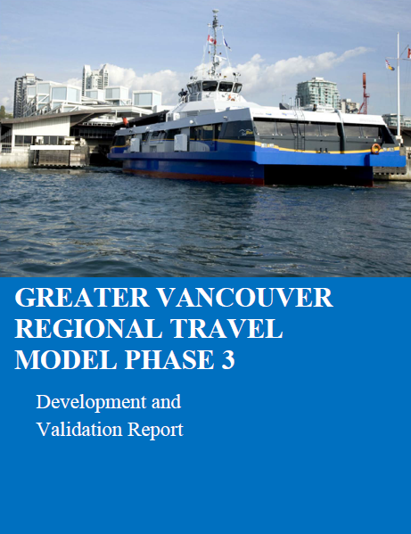

# Reports

## RTM Development Report

{: style="height:300px;width:230px"}

The RTM Phase 3 Development Report contains details on the modelling methodology, model structure and parameters, and model validation. Please access the report using the following link:  
[RTM_Development_Report.pdf]

<!-- links -->
[RTM_Development_Report.pdf]: asset/RTM_Development_Report.pdf
