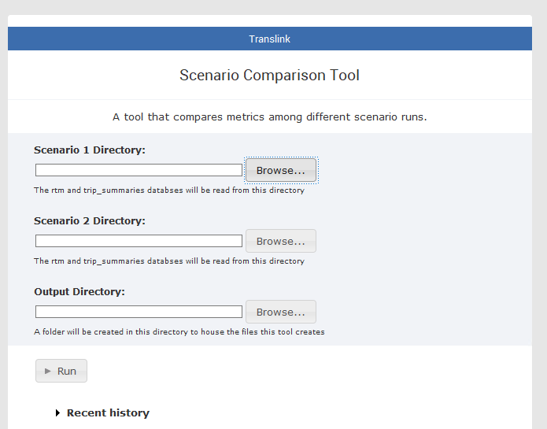

# Scenario Comparison Tool

## How it works

The Scenario Comparison EMME toolbox is an utility that allows planners/modellers to quickly compare metrics across two different EMME scenarios. This toolbox requires two RTM runs to be completed using the latest RTM version.

For each run of the RTM, the model will create two databases for each scenario the model was run for: `rtm.db`, and `trip_summaries.db`. The two databases house data relating to transportation metrics. The tool will connect to the pair of databases for each scenario, pull relevant data, join the data for each scenario, and then output the data for each metric/aggregation/disaggregation as a csv. 

The code reads from the configuration file `ScenarioComparison.json`. The config file will give a series of tables from the two databases for the script to pull from. For each table, the `disagg` field will give a list of columns to disaggregate by for the measure, what type of aggregation/group by action to perform (ex average or summing), and what columns to sum/average for (ex volumes or trips). 

In certain cases, the config file will also tell the script if it needs to rename certain columns in the database output, if multiple levels of aggregation are needed, or if custom SQL queries are needed (stored in the `queries` folder).

If multiple levels of aggregation is needed, the additional column of aggregation is specified under `"filter_col"`. The script will aggregate over each value specified under `"filter"`, and the values under the column specified in the `"col"` field.

The script uses one generic function to for each of the outputs. To add an additional output, or to remove/modify the output, the config file would need to be modified.

Measures are calculated in two ways.

1. If `"groupby":true`, then the script will group the database output by the `col` specificed using the aggregation specified in `"how"`. The resulting value is the aggregated results of the column specified in the `"value"` field.

2. If `"groupby":false`, then the script will aggregate all values specified in `"col"` according to the aggregation method specified in `"how"`. It will name the output of the aggregation according to the `"value"`. The disaggregation column will be named according to the name set under `"alias"`, and the disaggregation values are the names of the columns specified under `"col"`.

Nearly all measures are aggregated using `sum`. Fare measures (average fare by gy origin and average fares by period) are the only measures that aggregate using the mean. Most measures specified in the script/json are some form of a demand indicator, therefore the most best aggregation method is to sum the trips/crossings/boardings by disaggregation column.

The following image lists the tables that each of the outputs pulls data from. It also lists all the functions, and what outputs are created by each function.

## Interface

Once the tool has been imported to EMME, the tool needs 3 inputs to run. Scenario 1 Directory and Scenario 2 Directory refers to the directories that house the `rtm.db` and `trip_summaries.db` for each of the two scenarios. Output directory refers to the directory where the outputs will be saved to. The tool will create a folder named `ScenarioComparison` where all the output csvs will be saved to. 

## Output format

The outputs are saved in a single csv, where the name of the file is in the following format. 

`summary_comparison-1_{Scenario 1 ID}_{Scenario 1 Name}-2_{Scenario 2 ID}_{Scenario 2 Name}`

The tables are in the following format.

|metric|value_1_{Scenario 1 ID}_{Scenario 1 Name}|value_2_{Scenario 2 ID}_{Scenario 2 Name}|abs_change|rel_change|
|-----|-----|-----|------|------|
|fare_matrix_gy-fare-gy_i-7|4|6|2|0.5|

The name of each metric follows the following format.

`{Database table}-{Measure}-{Disaggregation Column}-{Disaggregation Value}`

For example, for `fare_matrix_gy-fare-gy_i-7`
* Data is pulled from the `fare_matrix_gy` table
* The values in the table are the average `fare`
* The data is disaggregated by `gy` origin zone
* This specific metric shows the average fare for origins from gy zone `7` for both Scenario 1 and 2
