# Model Workflow

In this section, we will show you the best practices when working with the RTM from setting up your environment to extracting model results.


## Requirements


We encourage all users and developers to be familiar with [EMME] as well as the RTM development stack: [python], [SQL] and [git]. If you are new to EMME, we recommend you to take [EMME Training Courses]. If you are new to programming, you should go through some online tutorials and documentations for [python], [SQL] and [git] before proceeding. 

* Licensed installation of [EMME Desktop 4.4.2]
* Installation of [git]
* Installation of [git lfs]
* Installation of [SQLite Studio]
* Installation of [Visual Studio Code] (optional)

!!! note

    A valid [EMME] license is required to run the RTM. See [Contributing] if you need help obtaining a license or need access to the RTM.


## Cloning the Model

To get the latest version of the rtm, clone it from the RTM github repository. The following bash commands will clone the repository from the master branch, and fetch the latest commit with large file storage support. Then, it will checkout the current branch into a new branch named `master_working_01`. We recommend that you rename the new branch based on the project you are working on:

```bash
git clone https://github.com/TransLinkForecasting/rtm.git --branch master --single-branch
cd rtm/
git fetch --all
git lfs install
git lfs pull
git checkout -b 'master_working_01'
```

To clone a specific official release, replace `master` with a version tag such as `RTM3.3`. If this is the first time you use git, you might need to set your name and email for git commits, see [Git Setup].


### Update File References

EMME toolbox stores absolute paths and they need to be updated when the model has been copied or moved to a new directory. Please also run the following after you clone the model:

```bash
cd 'RTM/Scripts/'
bash 'relocate_tools.sh'
```

Alternatively, you can run the batch file on Windows:

```bash
cd 'RTM/Scripts/'
start 'relocate_tools.bat'
```


## Folder Structure

The RTM is delivered as a collection of input files in the `BaseNetworks/` folder with a collection of python scripts in `Scripts/` folder. The EMME project file `RTM.emp` references all required folders and is loaded with a `Minimal Base Databank` stored in `Template/` folder.

Everything stored within the `RTM` folder is considered project-level, and run specific inputs are stored in the `BaseNetworks/` folder.

Before running the model, familiarize yourself with the model folder structure. 

```Markdown
    RTM/
    ├── BaseNetworks/
    │   └── Inputs/
    │
    ├── Documentation/
    ├── Logbook/
    ├── Media/
    ├── Scripts/
    ├── Template/
    ├── Views/
    ├── Worksheets/
    │
    └── RTM.emp
```

!!! warning

    Do not delete the `Minimal Base Databank` in EMME or the `Template/` folder. This is an empty placeholder databank that is packaged with the RTM to enable the initialization of databank through EMME Modeler or EMME Notebook.

<p></p>


### Base Networks Folder

The base network folder contains files required to build a databank from scratch. Each set of files in the main `BaseNetworks/` supply input data for each scenario year (for example: 2017, 2035, 2050), the set of files can be mainly classified as the following:

* Network batchin files: `base_network_*.txt`, `link_shape_*.txt`, etc
* Calibration factors (K-factors): `dist_factors_gy.csv.gz`
* External demand, bike scores: `externals_bikescore_*.csv.gz`
* Starter Skims: `start_skims.csv.gz`
* Fare zones: `fare_zones_travelled.csv.gz`
* Definition of ensembles: `taz1700_ensembles.csv`
* Definition of modes: `modes.in`
* Definition of transit vehicles: `tvehicles.in`
* Demographics and geographics of Metro Vancouver: `taz1700_demographics_*.csv`, `taz1700_geographics_*.csv`
* Geographic dummies: `taz1700_dummies.csv`
* Park and ride assumptions: `taz1700_pnr.csv`
* Time slicing: `time_slicing.csv`, `time_slicing_gb.csv`
* Transit bias calibrations: `transit_adj.csv`
* Truck model batch files: `TruckBatchFiles/*`

```Markdown
    RTM/
    ├── BaseNetworks/
    │   ├── base_network_*.txt
    │   ├── link_shape_*.txt
    │   ├── turns_*.txt
    │   ├── transit_lines_*.txt
    │   ├── extra_nodes_*.txt
    │   ├── extra_links_*.txt
    │   ├── extra_turns_*.txt
    │   ├── extra_transit_lines_*.txt
    │   ├── dist_factors_gy.csv.gz
    │   ├── externals_bikescore_*.csv.gz
    │   ├── fare_zones_travelled.csv.gz
    │   ├── start_skims.csv.gz
    │   ├── taz1700_ensembles.csv
    │   ├── modes.in
    │   ├── tvehicles.in
    │   │
    │   └── Inputs/
    │         ├── taz1700_demographics_*.csv
    │         ├── taz1700_geographics_*.csv
    │         ├── taz1700_dummies.csv
    │         ├── taz1700_pnr.csv
    │         ├── time_slicing.csv
    │         ├── time_slicing_gb.csv
    │         ├── transit_adj.csv
    │         └── TruckBatchFiles/
    │               ├── *AsiaPacificv1.txt
    │               ├── *CrossBorderv1.txt
    │               ├── IRBatchIn.txt
    │               ├── PMVActivity.txt
    │               └── RGBatchIn.txt
    └── ...
```
<p></p>


### Scripts Folder

This folder contains python scripts used to run the model:

* Toolbox relocate tool: `relocate_tools.bat`, `relocate_tools.sh`, `toolbox_modify.py`
* Model Scripts toolbox: `Phase3Scripts/`
* Analytics toolbox: `Phase3Analytics/`
* Model utility toolbox: `util/`
* Model tools, scripts and notebooks of model initialization and model runs: `util/`

```Markdown
    RTM/
    ├── Scripts/
    │   ├── relocate_tools.bat
    │   ├── relocate_tools.sh
    │   ├── toolbox_modify.py
    │   │
    │   ├── Phase3Scripts/
    │   ├── Phase3Analytics/
    │   ├── util/
    │   └── Tools/
    └── ...
```

!!! note

    The Scripts control the model behavior of the RTM. You are free to go through the script to familiarize with the implementation of the model. For more information regarding the modeling structure of the RTM, modeling decisions, data sources, estimation of sub models, please [contact us].

<p></p>


### Other Folders

* `Media` folder Contains shapefiles, ArcGIS maps. Output data are typically stored here.
* `Documentation` folder contains printable user manuals. 
* `Logbook` folder contains EMME logbook information generated by EMME Modeler tools. 
* `Template` folder provides an empty databank that allow Modeler to initialize new RTM databanks. 
* `View` folder contains standard views provided in the EMME environment.
* `Worksheets` folder contains standardized worksheets in the EMME environment.

```Markdown
    RTM/
    ├── Media/
    ├── Documentation/
    ├── Logbook/
    ├── Template/
    ├── Views/
    ├── Worksheets/
    └── ...
```

## Initialize Databank

You can initialize a single databank using the EMME Modeler or initialize multiple databanks using EMME Notebook, depending on your need.

To start the EMME, open the 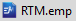 file. This will launch EMME, open the Minimal Base Databank's Placeholder Scenario when prompted.

### With EMME Modeler

1. To open Modeler, click on the EMME Modeler icon .

2. Once the Modeler opens, find Translink RTM Phase 3 Model toolbox and open the `Initialize Emmebank` tool:
> 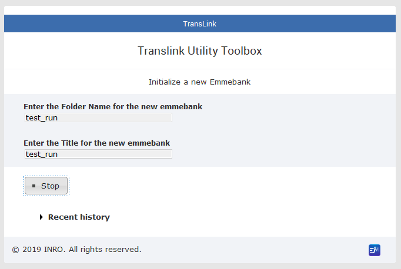

3. Enter a folder name and a name for the databank. Try to be descriptive. For example, if this is a databank for editing or debugging network only, name it `network_edit_something`, if this is a final copy of a new business as usual run for year 2050, name it `00_BAU_2050`. Once you enter the names, click **> Run**. 
> 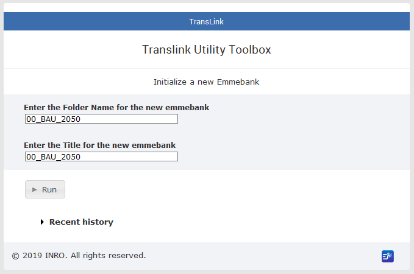

Once the run is completed, the **Tool complete** message will appear.
> 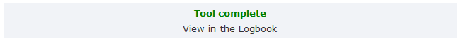

### With EMME Notebook

If you are comfortable with python and Jupyter Notebook, we strongly recommend that you use EMME Notebook to initialize databanks. This improves the reproducibility of your model run. This is generally not needed for network scenario or testing, but for final copy of a run, it is highly recommend.

The `init_many.ipynb` notebook contains a template for initialize many databanks.

1. To open EMME Notebook, click on the EMME Notebook icon .

2. The EMME Notebook should open in your browser, if it didn't open automatically, look for `http://localhost:xxxx/` in the EMME - Notebook command prompt window. The default is usually `http://localhost:8888/`.
> 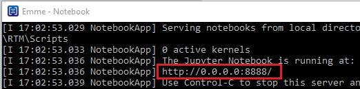

3. Once opened, you should see a list of folders in the `Scripts/` folder. Go to `Tools/` folder and make a duplicate of `init_many.ipynb`, name it to something more descriptive for your use, like `init_many_00_BAU_2050.ipynb`, then open it.
> 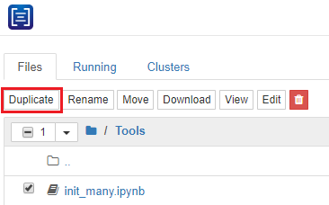
> 
> 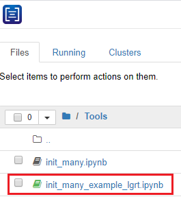

4. Modify params as needed, run the entire script to initialize the databank.
> 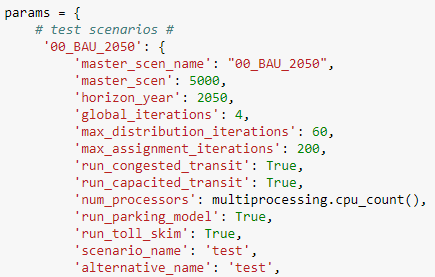
> 
> 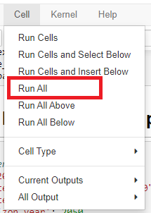


## Build Scenario

There are a wide range of changes you can make to the EMME base model for your study. We won't be able to cover them all in detail here, but here are some examples of model changes:

* demographics
* new roads or bridges
* new transit lines
* new transit stops
* transit fare
* tolls
* mobility pricing
* park and ride pricing
* etc...

<!-- TODO: add specific best practice guide for each type of model changes -->

### Network editing

The EMME Network Editor provides users the ability to create and modify nodes, links, turns, transit lines, and transit segments. We will use a BRT line example to illustrate how to add modes and vehicles for the RTM, and edit networks in EMME.

### Custom Inputs 

There are a number of custom inputs that the RTM uses at model initialization and run time to modify model behavior:

* At initiation
    * Transit vehicles and modes
* At runtime
    * Required files with model data
        * demographic and geographic
    * Optional files to manipulate model data
        * Scalars: `custom_scalars.csv`
        * Network: `custom_network.txt`
        * Transit Lines: `custom_tline.txt`
        * Transit Segment: `custom_tseg.txt`


The optional `custom_<datatype>` series files can be placed in the `RTM/<your run directory>/inputs` folder of the RTM instance.  These files are imported after the main model setup (`create scenarios` and `data import`) and can be used to change any model setting held in a scalar matrix or execute an arbitrary set of network link, transit line, or transit segment calculations.  Files with a `.csv` extension indicate comma delimited data while files with a `.txt` extension indicate tab delimited data.

!!! warning

    Do not leave a trailing new line or carriage return at the end of the files `custom_<datatype>.txt` files.  In addition, there can be only one file of each name in the inputs folder.  

#### Custom Scalars
This file allow the user to change data held in scalar matrices in the scripting without changing the scripting.  This in turn allows the user to run multiple runs with the same scripts and different scalar matrix data.  

The `custom_scalars.csv` file has headers and requires the following information in comma delimited format.

| Matrix ID | Matrix Name | Matrix Description | Value |
| --- | --- | --- | --- |
| The EMME Matrix ID number | The EMME Matrix Name | The EMME Matrix Description | The value to change |

Below is an example of changing the auto operating cost using the custom scalars file.

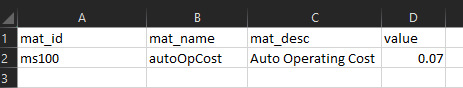

#### Custom Network
This file allows the user to execute an arbitrary set of network link calculations prior to running the model.  

The `custom_network.txt` file should not have headers and requires the following information in tab delimited format

| Period | Result | Expression | Selection | Aggregation |
| --- | --- | --- | --- | --- |
| AM, MD, PM, or ALL | Where the calculation should be stored (for instance @capacity) | The network calculation to be executed | Which link(s) to execute the calculation on (optional - can be left blank to update all links) | Results aggregation (optional and generally left blank) |

Below is an example of removing one lane and reducing capacity on links 111902-111904 and 111904-111902, and setting the signal delay to 0 for all links that are not VDF 14 for all three assignment periods.  Note that there is no carriage return on the last line.  

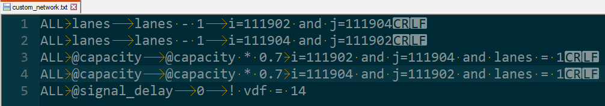

#### Custom Transit Lines
This file allows the user to execute an arbitrary set of network transit line calculations prior to running the model.  

The `custom_tline.txt` file should not have headers and requires the following information in tab delimited format

| Period | Result | Expression | Selection | Aggregation |
| --- | --- | --- | --- | --- |
| AM, MD, PM, or ALL | Where the calculation should be stored (for instance hdw) | The network calculation to be executed | Which line(s) to execute the calculation on (optional - can be left blank to update all lines) | Results aggregation (optional and generally left blank) |

Below is an example of reducing the headway on all lines except those in the Fraser Valley during the AM and PM peak hours, and setting the signal delay to 0 for all links that are not VDF 14 for all three assignment periods.  Note that there is no carriage return on the last line.  

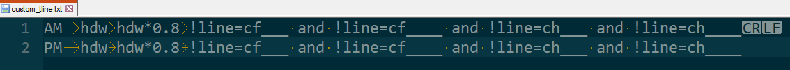


#### Custom Transit Segments

This file allows the user to execute an arbitrary set of network transit segment calculations prior to running the model.  

The `custom_tseg.txt` file should not have headers and requires the following information in tab delimited format

| Period | Result | Expression | Selection | Aggregation |
| --- | --- | --- | --- | --- |
| AM, MD, PM, or ALL | Where the calculation should be stored (for instance ttf) | The network calculation to be executed | Which line(s) to execute the calculation on (optional - can be left blank to update all lines) | Results aggregation (optional and generally left blank) |

Below is an example of changing the transit time function (ttf) on links 111902-111904 and 111904-111902 to ttf2.  Note that there is no carriage return on the last line.  

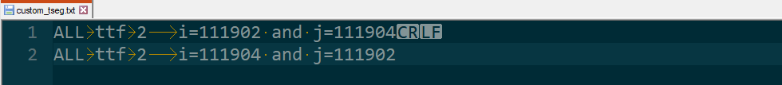


### Example: 2050 BRT Line

Similar to most model application exercises, in our example, there are two main components of changes we are making to the 2050 base model: network editing and model custom inputs.

* Network editing - adding a new transit line
* Custom inputs
    * Add congestion pricing to the network with `custom_network.txt` input file
    * Use a custom demographic file for corridor intensification


#### Step 1: add new modes

Before we create a new transit line, we need to make sure the mode and the vehicle of is available, add the new mode to `modes.in` file in the base network folder:

> 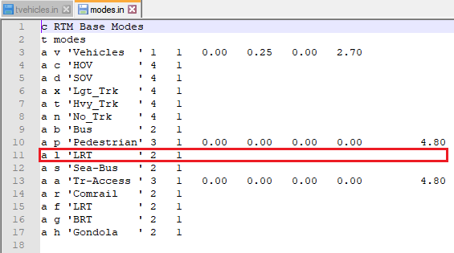

Then check the `tvehicles.in` file in the base network folder:

> 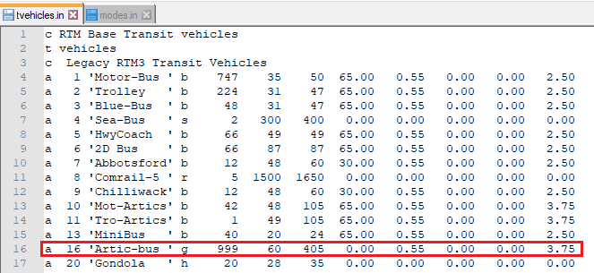

After new modes or vehicles are added, it won't be available in the already initialized databank and scenario. You should re-initialize a working copy of the databank.

!!! note

    Choosing the BRT and LRT vehicle in `tvehicles.in` with `modes.in` implements the unobserved mode discussed in the October 2019 User Group Meeting. [Presentation available here].
    

#### Step 2: create new scenarios

Duplicate the base scenario input files, and rename them with a new scenario number. For example, if you are making changes on top of scenario "5000", name it "5001", "5002".

> 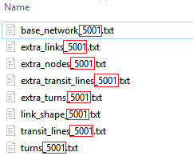

> 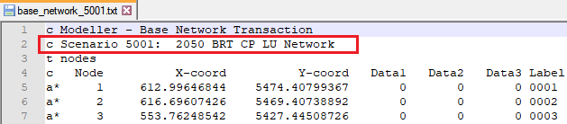


##### Load new scenario manually

To load new scenario into your current data bank, open Modeler and Import Network Tool:

> 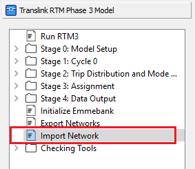

Enter the scenario number and a title for it, click run to load the scenario.

> 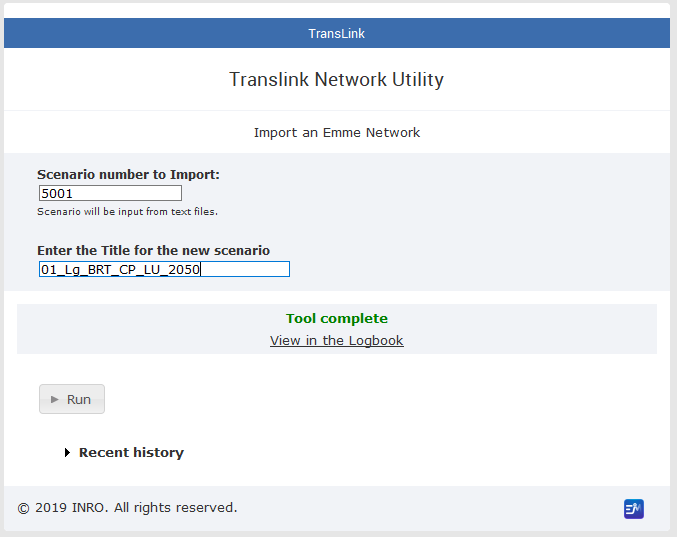

It now should be available in the list of scenario and you can set it as your active scenario to perform your network changes.

> 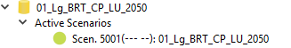


##### Optional: Always load new scenario on databank initialization

If you want the newly created scenario to be imported every time you initialize a new emmebank, modify `InitEmmebank.py`. Once you set up the scenarios, add these new scenario numbers into the `InitEmmebank.py` script. This will allow the initialize emmebank modeler tool to load the new scenarios.

> 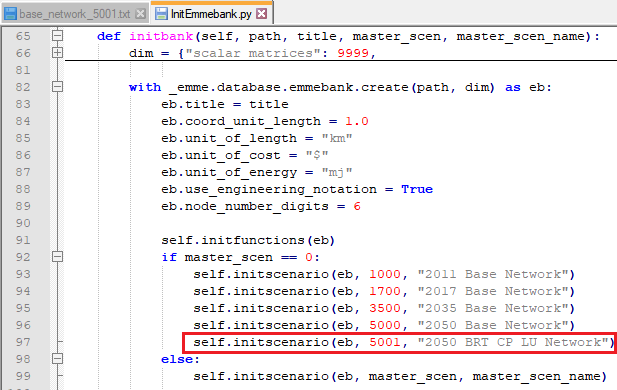

Now, you can initialize a new databank and your new scenario will be loaded by default. You can give it a descriptive and abbreviated name such as `01_Lg_BRT_CP_LU_2050`.


#### Step 3: perform network editing

 Open EMME network editor , add notes, links, and transit line as needed. Make sure you save a copy of the build file before you save and exit the scenario. **Build files can be created from any changes you made while in the Network Editor.** The build file is a great way to save and replicate model network changes. If you have a build file, you can stage it and run the changes.
 
* Copy your build file to `Network_builds/` folder.
* Open "Network History and Builds" prompt from EMME Network Editor 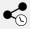. Click the folder icon to "Add network builds", then click "Stage".
* Preview the build, then run the build:

> 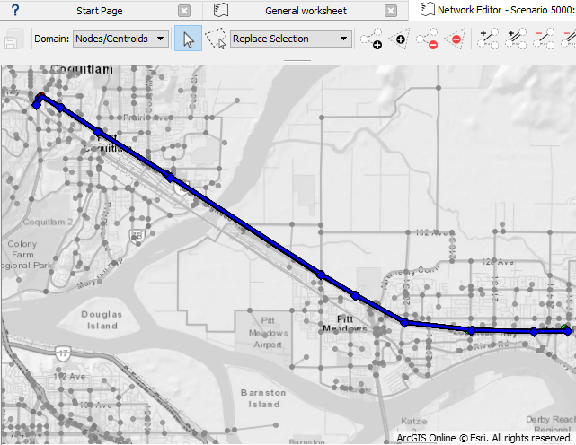


#### Step 4: set up custom inputs

For the BRT example, we will use `custom_network.txt` and a simple 8-zone shapefile to add congestion pricing attribute to the network in batch. We will also load a custom demographic file with 20% population intensification along the study corridor.

* Custom inputs often require link tagging defined by the intersection of input polygons and network links in EMME. This can be done in Modeler or Notebook using the Geographic Tagging Tool:
> 
> 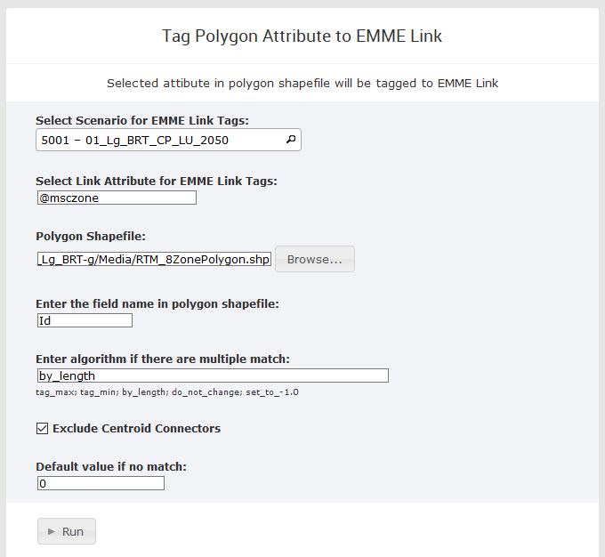

* After link tagging, the custom input file such as `custom_network.txt` needs to be placed in the `Input/` folder within the emme databank folder, such as the folder `db_01_Lg_BRT_CP_LU_2050` or `01_Lg_BRT_CP_LU_2050`. (Do not place the file in the BaseNetworks folder!)
> 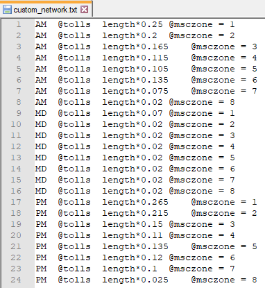

Read more about [Custom Networks].

!!! note

    Read more on link tagging tool in: `RTM\Documentation\ToolDoc_GeographicTagging.pdf`.


* The custom demographic file such as `taz1700_demographics_2050-20.csv` needs to be selected as the demographic input when running the model.
> 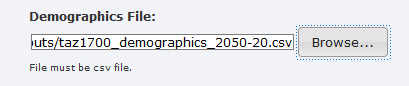


## Export Scenario

While in most cases your current databank for the alternative scenario is ready to run, it is important to export your new scenario network and organize all input files into a sub folder within the `Scenario_Inputs` folder. This allows you to share your new scenario with other users without needing to copy the entire databank with results. This also allow you to quickly reinitialize the scenario to run on a newer version of the RTM.

### Export Network

To export your scenario's network, open EMME Modeler:

> 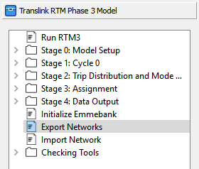

Then select your new scenario to export:

> 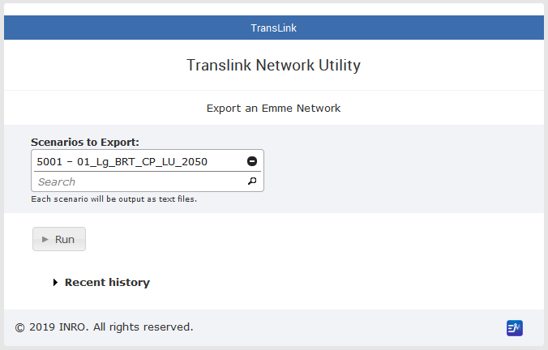


### Organize Scenario Inputs

We highly recommend that you store every input required to rebuild your new scenario and replicate your model run within a sub folder of the `Scenario_Inputs` folder. For our example, this would be the folder structure for all the changes we have made in our BRT example:

```Markdown
    RTM/
    ├── Scenario_Inputs/
    │   └── 01_2050-20-hw8-cp_Lg_BRT-g/
    │         ├── custom_network.txt
    │         ├── modes.in
    │         ├── tvehicles.in
    │         │
    │         ├── BaseNetworks/
    │         │      ├── Inputs/
    │         │      │       └── taz1700_demographics_2050-20.csv
    │         │      ├── base_network_5001.txt
    │         │      └── ...
    │         ├── Scripts/Phase3Scripts/
    │         │      ├── Tools/
    │         │      │       │── init_many_example_lgrt.ipynb
    │         │      │       └── run_many_example_lgrt.ipynb
    │         │      └── Phase3Scripts/
    │         │             └── InitEmmebank.py
    │         └── Media/
    │               └── RTM_8ZonePolygon.shp
    └── ...
```

## Run Model

You can run the model using a single databank using the EMME Modeler or run multiple databanks using the EMME Notebook, depending on your need. 

### EMME Modeler

Once you have set up all the input files in the databank, such as customized demographics, custom input files, etc, you are ready to do a full model run using the EMME Modeler.

1. To open Modeler, click on the EMME Modeler icon .

2. Find Translink RTM Phase 3 Model toolbox and open the `Run RTM3` tool:
> 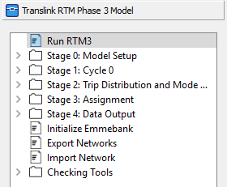

3. Change the Full Model Run settings as needed. Make sure to enter the correct model horizon year, scenario, demographic and geographic inputs.
> 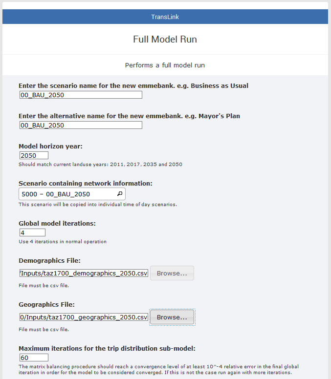
> 
> 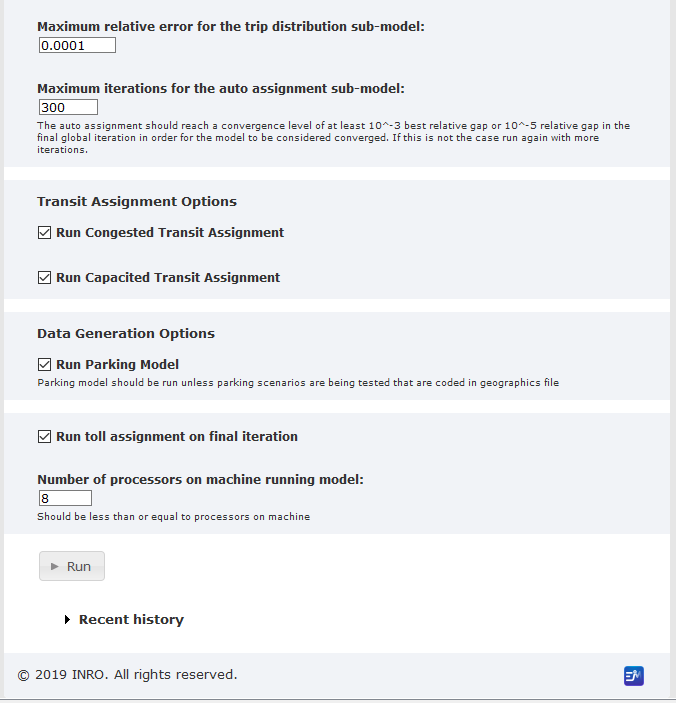

4. Click `Run`. Each model run can take 2 to 4 hours depending on the custom settings and scenario.

!!! warning

    Do not interrupt the model run. The RTM model is not designed to be run in separate stages or run multiple times. If you stopped a model run before it is done, you should start over and run the model again.


### EMME Notebook

The `run_many.ipynb` notebook contains a template for running many model runs. It handles multiple model runs and runs with complex set up. It is ideal for our BRT example where we needed to perform link tagging and use custom network input file for congestion pricing. Note sometimes additional coding is required to call toolboxes that are relevant to the particular model run.

1. To open EMME Notebook, click on the EMME Notebook icon .

2. The EMME Notebook should open in your browser, if it didn't open automatically, look for `http://localhost:xxxx/` in the EMME - Notebook command prompt window. The default is usually `http://localhost:8888/`.
> 

3. Once opened, you should see a list of folders in the `Scripts/` folder. Go to `Tools/` folder and make a duplicate of `run_many.ipynb`, name it to something more descriptive for your use, like `run_many_00_BAU_2050.ipynb` or `run_many_example_lgrt.ipynb`, then open it.
> 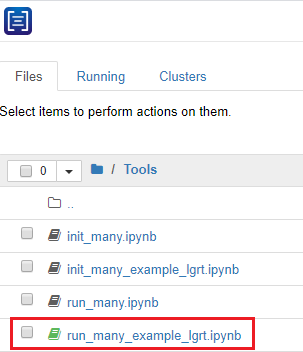

4. Modify params as needed.
> 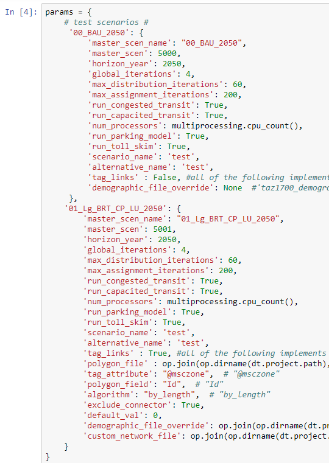

5. Make sure you carefully review the script associated with the model run. You may need to add new code to this section depending on the requirements of your model run.
> 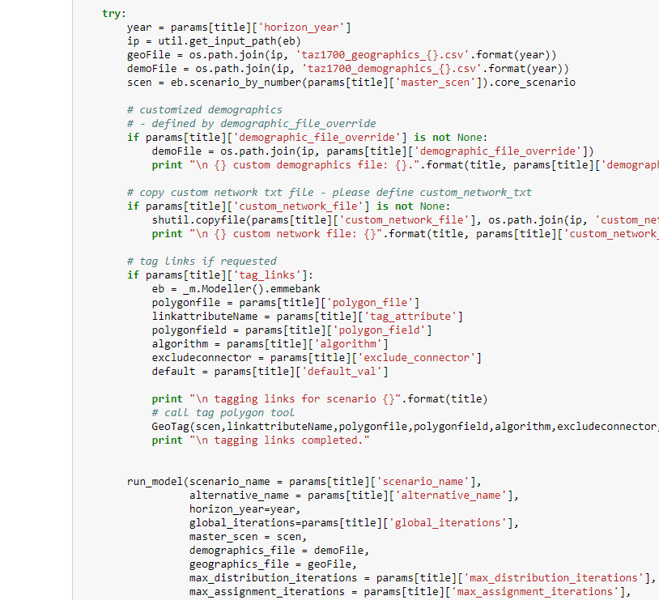

6. Run the entire script to perform the full model run with custom settings.
> 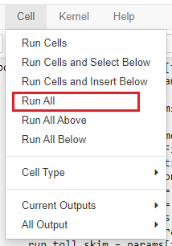


## Commit Changes

If this is your first time using [git] after an installation, see [Git Setup].

While working with the RTM on git, here are some ground rules:

* Main project branches (*master*, *example_brt_proj*) are always protected. Push a temp branch then do pull request to merge your changes
* Only stage and commit model inputs and settings, never databanks
* Any scenario-specific changes for scripts should be placed into `Scenario_Inputs` for commit
* Organize a `Scenario_Inputs` folder when you finish a scenario
* Use active verb for commit messages, like "add scenario inputs for brt examples."

!!! warning

    Do not commit the databank associated with the model run. We recommend you to place the databank folders in your version of the `.gitignore`.

    When staging and committing model changes, think about what other users or developers may need to run your scenario from scratch. **Commit inputs and set up, not the results.**


### Push Changes to GitHub

If you are a collaborator, you may push your changes to the rtm repository on GitHub. You will not be able to push directly to most of the branches already on the rtm repository as they are protected, so always push your working branch and merge to any main branch with a pull request. An admin will review your changes when you submit a pull request.

```bash
git push origin master_your-project
```

Learn more about [git] and read more about [GitHub pull request].


<!-- Links -->
[Custom Networks]: ../workflow/#custom-network
[Contributing]: ../about/contributing
[Contact us]: ../about/contributing
[Presentation available here]:https://github.com/TransLinkForecasting/rtm-workshops/blob/master/2019-Oct/5.Modeling_Non-existing_Modes.pdf
[Python]: https://www.learnpython.org/
[SQL]: https://www.w3schools.com/sql/
[git]: https://git-scm.com/docs
[git lfs]: https://git-lfs.github.com/
[SQLite Studio]: https://sqlitestudio.pl/index.rvt?act=download
[Visual Studio Code]: https://code.visualstudio.com/download
[EMME]: https://www.inrosoftware.com/en/products/emme/
[EMME Desktop 4.4.2]: https://blog.inrosoftware.com/blog/emme-4.4-release
[EMME Training Courses]: https://www.inrosoftware.com/en/services/training/
[Git Setup]: https://git-scm.com/book/en/v2/Getting-Started-First-Time-Git-Setup
[GitHub pull request]: https://help.github.com/en/github/collaborating-with-issues-and-pull-requests/creating-a-pull-request
