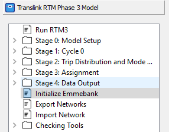

# Run the Model Workflow

In this section, we will show you the best practices when working with the RTM from setting up your environment to extracting model results.

## Requirements

We encourage all users and developers to be familiar with EMME as well as the RTM development stack: python, SQL and git. But if you are new to EMME or programming, you may want to pick your learning path based on your needs.

### For EMME users and developers
* INRO EMME license and installation (EMME Desktop 4.4.2)
* Ability to use EMME Modeler
* Ability to use EMME Network Editor
* Ability to use EMME Worksheets / Tables
* Familiarity with [Python]
* Familiarity with [SQL]
* Familiarity with [git]

[Python]: https://www.learnpython.org/
[SQL]: https://www.w3schools.com/sql/
[git]: https://git-scm.com/docs

!!! note

    A valid [EMME] license is required to run the RTM. Please contact us if you need help.

[EMME]: https://www.inrosoftware.com/en/products/emme/

## Cloning the model

`git clone https://github.com/TransLinkForecasting/rtm.git`

`cd rtm/`

`git fetch --all`

`git lfs install`

`git lfs pull`

optionally, you 

### File Folder Structure

!!! warning

    Do not delete the `Minimal Base Databank`. This is an empty placeholder databank that is packaged with the RTM to enable the initialization of databank through EMME Modeler or Notebook.

## Init an RTM instance

Go initialize it

## Manipulate as needed

## Export/Commit

## Custom Settings
   - Scalars
   - Network
   - Attribute
   - Transit Segment

